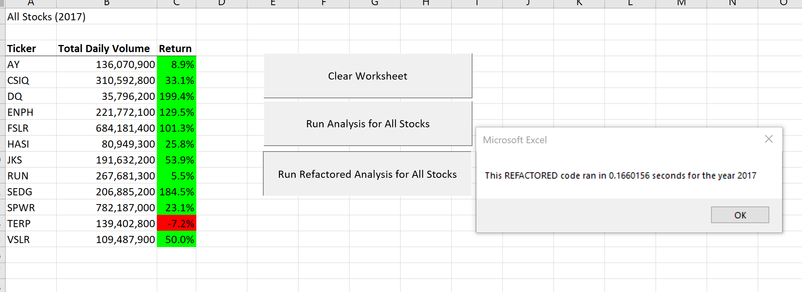

# Stock Analysis Challenge – Evaluating Refactored Code
## Project Overview
Our client, Steve, asked us to automate the calculation of the trade volume and price change for a set of “Green” stock tickers within 2 specific years.  Steve wants to help his parents choose better performing stocks than the one they chose originally - “DQ”. He also wants to be able to evaluate more stocks in the future so he needs a well performing analysis tool where he can increase the number of stocks he evaluates.  

In the first pass of writing this automation, an array was used for the tickers.  The analysis looped through the full record-set of the year chosen for each of the 12 ticker symbols.  Having multiple loops is less efficient than a single loop through the record-set.  To reduce processing time, a set of arrays can be created to aggregate the data for each ticker and then present the results for all tickers at one time.  In this challenge, the code was refactored in this way.

To prove that processing time is less for the refactored code, the run-time was captured for the initial macro and the refactored macro.  In the following sections, we’ll show proof that refactored code runs faster and discuss the changes made.

## Results
With the refactor, the runtime of the analysis decreased by over 3.5 seconds for both 2017 and 2018 datasets.  Below are pictures of the time captures for each year:

### 2017

**Original Macro**

**Refactored Macro**

### 2018

**Original Macro**

**Refactored Macro**

As you can see, there was a drastic decrease in both years with the refactor.  

### Code Review

Below are two code snippets to show how the macro was changed.  The first code snippet shows the inner loop.  The second code snippet shows that there is no longer an inner loop and we use a set of IF statements to aggregate the data in arrays. 

**Original Code with Inner Loop**

**Refactored Code with use of Additional Arrays**

## Summary

Refactoring code is an important step in the development process.  Many times, when writing code to solve a problem, solving the problem is the top priority.  Knowing how to make the code run efficiently and at scale is not always evident before the problem is solved.  Having a refactor step in a development process is a great way to fix performance issues before they get into a production environment.  The disadvantages to refactoring code is that there can be bugs introduced during this step and it prolongs the development life-cycle. 

For this particular exercise, the pros far outweighed the cons of a refactoring step.  The dataset was known and could be tested so bugs could be rooted out.  The performance of the code could be measured so the goal of reducing processing time could be tested.   Overall, this development project benefited from spending the time to refactor the macro.

